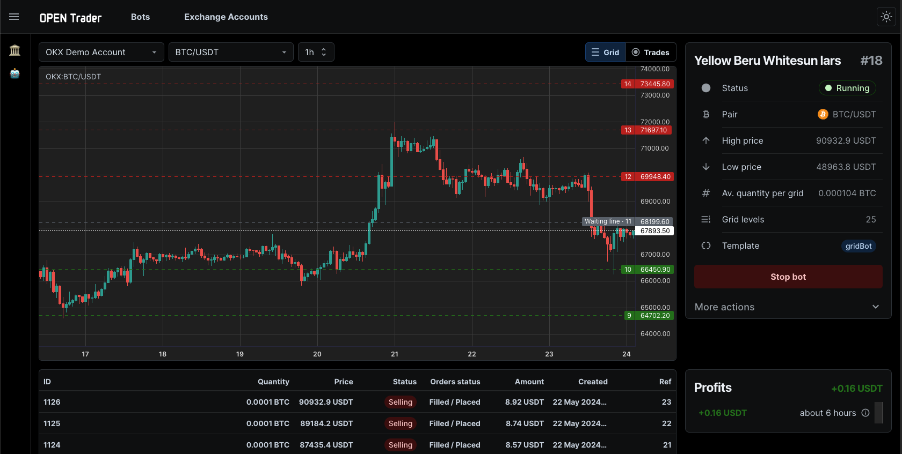

<p align="center">
  <a href="https://github.com/darbotlabs/agentrader" title="agentrader">
    
  </a>
</p>

[](https://github.com/darbotlabs/agentrader/actions)
[](https://www.npmjs.com/package/agentrader)
[](https://github.com/darbotlabs/agentrader/graphs/contributors)
[](https://x.com/intent/follow?screen_name=agentraderLabs)
[](https://discord.gg/RS7y3ffvvG)
[](https://www.reddit.com/r/agentrader)
[](https://t.me/+cJLNxLSjcW83Njgy)

[agentrader](https://github.com/darbotlabs/agentrader) is a self-hosted cryptocurrency trading bot, featuring built-in and highly customizable strategies, integration with technical indicators, high-frequency trading, and cross-exchange trading with support for 100+ exchanges via CCXT.

**Features:**

- **✨ Robust UI**: A user-friendly interface for managing the bots.
- **🌐 Multiple Exchanges:** Trade across various cryptocurrency exchanges.
- **📝 Paper Trading**: Test your strategies without risking real money.
- **📊 Backtesting:** Backtest your strategies using historical data.
- **⚙️ Easy Installation:** Install effortlessly via NPM.

**Strategies:**

- ☑️ [GRID](packages/bot-templates/src/templates/grid-bot.ts): Make profits from market fluctuations by creating a grid of buy and sell orders.
- ☑️ [DCA](packages/bot-templates/src/templates/dca.ts): Entry with multiple orders to average the entry price and sell on price swings.
- ☑️ [RSI](packages/bot-templates/src/templates/rsi.ts): Places orders based on the RSI indicator value.
- 🛠️ [CUSTOM](https://github.com/Open-Trader/custom-strategy): Build your own strategy in just a few lines of code.


# ⚡️ Quick start

Get started with agentrader in just a few steps. Follow this quick guide to install, configure, and run your crypto trading bot.

> [!NOTE]
> agentrader requires Node.js v22 or higher. You can check your Node.js version by running `node -v`

## Installation

1. Install agentrader globally using npm:

```bash
npm install -g agentrader
```

2. Set an admin password for later accessing the agentrader UI:

```bash
agentrader set-password <password>
```

3. Start the agentrader app

```bash
agentrader up
```

The app will start the RPC server and listen on port 8000.

> **Tip**: Use `agentrader up -d` to start the app as a daemon. To stop it, run `agentrader down`.

# Usage

## UI

The user interface allows managing multiple bots and strategies, viewing backtest results, and monitoring live trading.



You can access the agentrader UI on: http://localhost:8000

## CLI

### Connect an exchange

Copy the `exchanges.sample.json5` file to `exchanges.json5` and add your API keys.

> Available exchanges: OKX, BYBIT, BINANCE, KRAKEN, COINBASE, GATEIO, BITGET

### Choose a strategy

Create the strategy configuration file `config.json5`. We will use the `grid` strategy as an example.

```json5
{
  // Grid strategy params
  settings: {
    highPrice: 70000, // upper price of the grid
    lowPrice: 60000, // lower price of the grid
    gridLevels: 20, // number of grid levels
    quantityPerGrid: 0.0001, // quantity in base currency per each grid
  },
  pair: "BTC/USDT",
  exchange: "DEFAULT",
}
```

> Currently supported strategies: `grid`, `dca`, `rsi`

### Run a backtest

Command: `agentrader backtest <strategy> --from <date> --to <date> -t <timeframe>`

Example running a `grid` strategy on `1h` timeframe.

```bash
agentrader backtest grid --from 2024-03-01 --to 2024-06-01 -t 1h
```

> To get more accurate results, use a smaller timeframe, e.g. 1m, however, it will take more time to download OHLC data from the exchange.

### Running a Live Trading

Command: `agentrader trade <strategy>`

Example running a live trading with `grid` strategy.

```bash
agentrader trade grid
```

> To stop the live trading, run `agentrader stop`

# Project structure

- Strategies dir: [packages/bot-templates](/packages/bot-templates/src/templates)
- Indicators: [packages/indicators](/packages/indicators/src/indicators)
- Exchange connectors: [packages/exchanges](/packages/exchanges/src/exchanges)

